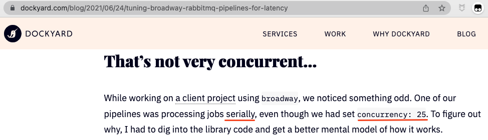
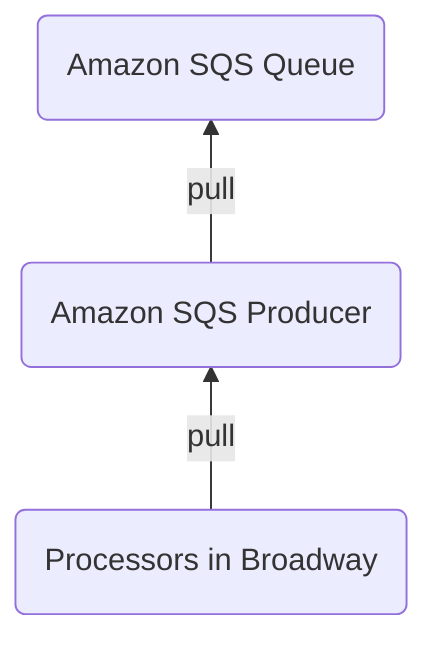
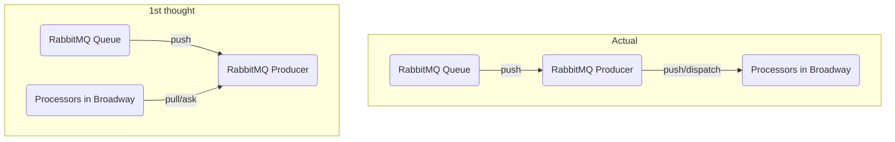

title: Experience of Broadway Source Reading，PR Submission for Bug Fixing
speaker: 鹄思乱想（Ken）
plugins:
    - echarts
    - mermaid

<slide class="aligncenter" image="https://source.unsplash.com/2dqaasndUKE/">

<slide class="aligncenter">

# Source Reading & Fix {.text-landing.text-shadow}

By 鹄思乱想（Ken） {.text-intro}

:::note

大家好，和各位大佬比起来，我其实没什么线上使用 Elixir 和 Broadway 的经验，这次分享只是基于自己单纯看源代码的经历。分享里有什么说的不对，希望大家指正。


<slide class="aligncenter ">

# Who am I?

* Blog\: https\://www.thinkingincrowd.me
* Wechat\: ThinkingInCrowd
* Github\: https\://github.com/kenspirit
* Bio\:
    * Consortium Blockchain Platform Developer for Carrier Logistics based on Fabric.
    * Work with Node.js/JAVA，Play with Elixir.
    * Practicing Boxing.


<slide class="aligncenter ">

# Agenda

* Problem\: Concurrent Framework Becomes Parallel
* What is Broadway?
* Source Code
* Source Analysis on Bug
* Q & A
* My Questions

:::note

这次其实是按陈天老师在知乎的「如何阅读一份代码」文章里说的「为了破案而阅读代码」的方式，来介绍一个场景相关的源码的，而不是按照整个框架结构来分析。所以，一开始我会先说明疑案是什么，然后介绍相关的源码。虽然可能很多人都用过 Broadway，也对它比较熟悉，但讲相关源码前，会很粗略地讲一下它是什么，和数据处理流程。最后就是 Q&A 和我想请教大家的问题。


<slide class="aligncenter ">

## Problem\: Concurrent Framework becomes Parallel

!

:::note

这个问题很经典，估计我们都遇到过。作者在使用一个声称是能并发处理数据的框架时，发现自己的数据被串行处理。这次就带大家看看是怎么一回事。你们有兴趣也可以回头对比看他是怎么看源码和加 Debug Log 分析的。


<slide class="aligncenter ">

# What is Broadway?

:::note

首先，我简单介绍一下 Broadway。


<slide class="">

## What is Broadway? {.aligncenter}

**Concurrent**, **multi-stage** tool for building data ingestion and data processing **pipelines**.

:::div {.text-cols.animated.fadeInUp.slow.delay-2400}

```elixir
defmodule MyBroadway do
  use Broadway

  def start_link(_opts) do
    Broadway.start_link(MyBroadway,
      name: MyBroadwayExample,
      producer: [
        module: {Counter, []},
        concurrency: 2
      ],
      processors: [
        default: [concurrency: 2]
      ]
    )
  end

  ...callbacks...
end
```

```asciidoc
  [producer_1]  [producer_2]
      |     \    /    |
      |      \  /     |
      |       \/      |
      |       /\      |
 [processor_1]  [processor_2]
```

:::

:::note

Broadway 是一个并发，多阶段的数据处理管道。相信喜欢和熟悉函数式编程的都知道 Pipeline 是什么意思了。
这个就是用 Broadway 定义的一个最简单的管道处理模型，这里只有两个数据生产者，两个处理者。它们关系如右图。


<slide class="">

## Broadway is built on GenStage {.aligncenter}

* Producer\: A stage sends data.
* Consumer\: A stage receives data.

> "Once demand arrives, the producer will emit items, never emitting more items than the consumer asked for.  This provides a back-pressure mechanism." {.animated.fadeInUp.slow.delay-2400}

**Characteristics\: Ask demand from Upstream. (Kanban Style)** {.animated.fadeInUp.slow.delay-4s}

:::note

Broadway 其实是基于 GenStage 来构建的。GenStage 里面只有两个概念，Producer 和 Consumer。一个负责发送数据，一个接收处理。同时承担发送和接收的，就既是 Producer，也是 Consumer。它的工作原理是等需求到达 Producer 的时候，它会分配不多于需求数量的消息给 Consumer。所以说，它和敏捷方式里面的 Kanban 拉动模型类似。


<slide class="aligncenter ">

## Pull (Proactive)



:::note

刚才说到，GenStage 或者 Broadway 的整体设计理念，是拉动需求的模式。所有，像 Amazon SQS 这种 Producer，它的处理流程就很顺。


<slide class="aligncenter ">

# Push (Passive)

RabbitMQ **prefetch_count** option



:::note

但是，对于像 RabbitMQ 队列这种，Producer 是被动从队列接收消息的。所以，它其实不是使用拉动的机制，因为有可能要数据的时候没有，没要的时候又一堆在等着。RabbitMQ 采用的是配置 prefetch_count 参数来控制流量。


<slide class="aligncenter">

## Why the "Parallel" issue happens?

:::note

了解了这些基本概念，我们猜一下为什么文章作者会遇到的问题呢？


<slide class="">

## Why the "Parallel" issue happens? {.aligncenter}

> "If a processor asks for two messages and there are two producers, the processor may get four messages.
>
>Since it can only process them one at a time, the others will sit in its process mailbox until it’s ready for them."

**Each producer tries to satisfy the demand of every processor.  One Processor takes all msgs** {.animated .fadeInUp .slow .delay-4s}

:::note

其实作者在文章中也提前总结出来了。原因是假设有两个 producer，每个 processor 都向它们要两条消息的时候，最终 processor 拿到的是 4 条消息。结果很明显，一个 processor 拿到全部消息，每次它只能处理一条，所以就变成串行的了。


<slide class="">

## Solutions {.aligncenter}

| Item                      | Change |
| :-----------              | :------------ |
| Producers                 | M  ->  1 |
| Processors Max Demand     | 10  ->  1 |
| RabbitMQ Prefetch Count   | max_demand * \<number of processors> |

:::note

所以，要解决问题，方法也很简单，就是把 Producer 数量调成 1，每个 Processor 的 max_demand 参数也调成 1。
RabbitMQ 的 Prefetch Count 也调整为和 Processor 数量及最大需求匹配上。

问题和解决方案作者都总结出来了，但是他没有去找哪里的源码导致这个问题。


<slide class="aligncenter ">

# Source Code

:::note

下面，我们看看相应的源码是怎么样的。


<slide>

## How do Producers Distribute Msgs? {.aligncenter}

#### Subscription Logic in Processor

::: {.grid.sm}

!

```elixir {..column ..small ..animated ..fadeInUp ..slow ..delay-4s}
defmodule Broadway.Topology.ProcessorStage do
  use GenStage

  def start_link(args, stage_options) do
    Broadway.Topology.Subscriber.start_link(
      __MODULE__,
      args[:producers],

  ...
end

defmodule Broadway.Topology.Subscriber do
  @behaviour GenStage

  def init({module, names, options, subscription_options}) do
    {type, state, init_options} = module.init(options)

    ...

    # We always subscribe in random order so the load is balanced across consumers.
    names |> Enum.shuffle() |> Enum.each(&subscribe(&1, state))

    ...
  end
end
```

:::

:::note

在了解 Producer 如何分发消息之前，我们先看看 Processor 和 Producer 之间的订阅关系是怎么建立的。

Broadway 源码的整体结构，其实才不到 20 个源文件，名字也很容易让人理解各自负责哪一部分。所以，我们直接就可以看 ProcessorStage 相关的代码。它一启动就会调用 Subscriber 的启动代码，里面就可以看到注释下的那句，shuffle 了 producer 的名字，然后逐个订阅。意图也在注释说清楚了。


<slide class="">

## How do Producers Distribute Msgs? {.aligncenter}

#### Subscription Logic in GenStage

::: {.grid.sm}

!

```elixir {..column ..small ..animated ..fadeInUp ..slow ..delay-4s}
defmodule GenStage do
  ...

  defp consumer_subscribe(current, to, opts, stage) do
    with {:ok, max, _} <- ...
         {:ok, min, _} <- ...
         {:ok, cancel, _} <- ...
      producer_pid = GenServer.whereis(to)

      cond do
        producer_pid != nil ->
          ref = Process.monitor(producer_pid)
          # 1. Subscription Logic for Producer
          msg = {:"$gen_producer", {self(), ref}, {:subscribe, current, opts}}
          send_noconnect(producer_pid, msg)
          # 2. Subscription Logic for Consumer
          consumer_subscribe(opts, ref, producer_pid, cancel, min, max, stage)
```

:::

:::note

如果我们追着订阅的逻辑，看到 GenStage 里面的话，可以看到它会往 producer 发送一个消息，然后接下去做 consumer 订阅后的逻辑。GenStage 的源文件更少，主要就是 gen_stage 主文件，和几个 dispatcher。


<slide class="">

## How do Producers Distribute Msgs? {.aligncenter}

#### 1. Subscription Logic of Producer


```elixir {..column ..small}
defmodule GenStage do
  ...

  def handle_info(
        {:"$gen_producer", {consumer_pid, ref} = from, {:subscribe, cancel, opts}},
        %{consumers: consumers} = stage
      ) do
    case consumers do
      %{^ref => _} -> ...

      %{} ->
        case maybe_producer_cancel(cancel, stage) do
          {:noreply, stage} ->
            mon_ref = Process.monitor(consumer_pid)
            stage = put_in(stage.monitors[mon_ref], ref)
            stage = put_in(stage.consumers[ref], {consumer_pid, mon_ref})
            producer_subscribe(opts, from, stage)
```

```elixir {..column ..small ..animated ..fadeInUp ..slow ..delay-4s}
  defp producer_subscribe(opts, from, stage) do
    %{mod: mod, state: state, dispatcher_mod: dispatcher_mod, dispatcher_state: dispatcher_state} =
      stage

    case maybe_subscribe(mod, :consumer, opts, from, state) do
      {:automatic, state} ->
        stage = %{stage | state: state}

        # Call the dispatcher after since it may generate demand
        # and the main module must know the consumer is subscribed.
        case dispatcher_mod.subscribe(opts, from, dispatcher_state) do
```

:::note

Producer 收到订阅消息后做什么呢？它会记录下自己和 consumer 之间的关系，然后调用 dispatcher 模块的 subscribe 方法。


<slide class="">

## How do Producers Distribute Msgs? {.aligncenter}

#### 1.1 Subscription Logic of Dispatcher


```elixir {..column ..small}
defmodule GenStage.DemandDispatcher do

  def subscribe(_opts, {pid, ref}, {demands, pending, max}) do
    {:ok, 0, {demands ++ [{0, pid, ref}], pending, max}}
  end
```

:::note

在开始那个最简单的 Broadway 配置下，它使用的是 DemandDispatcher。而 subscribe 的逻辑就是把这个 consumer 的进程 id，和 reference 记录下来，放到 demands 列表里。到这里，Producer 的部分就基本结束了。那刚才 Consumer 接下来做什么呢？


<slide class="">

## How do Producers Distribute Msgs? {.aligncenter}

#### 2 Subscription Logic of Consumer


```elixir {..column ..small}
defmodule GenStage do

  defp consumer_subscribe(opts, ref, producer_pid, cancel, min, max, stage) do
    %{mod: mod, state: state} = stage
    to = {producer_pid, ref}

    case maybe_subscribe(mod, :producer, opts, to, state) do
      {:automatic, state} ->
        # Immediately ask for msg after subscription
        ask(to, max, [:noconnect])
        stage = put_in(stage.producers[ref], {producer_pid, cancel, {max, min, max}})

  ...

  def handle_info(
        {:"$gen_producer", {consumer_pid, ref} = from, {:ask, counter}},
        %{consumers: consumers} = stage
      )
      when is_integer(counter) do
    case consumers do
      %{^ref => _} ->
        %{dispatcher_state: dispatcher_state} = stage
        dispatcher_callback(:ask, [counter, from, dispatcher_state], stage)
```

:::note

你看它这里马上调用了一个 ask 的方法，然后记录下它和 Producer 的关系。这个 handle_info 的方法，就是 Producer 收到 ask 消息后，根据请求的量，再调用 dispatcher 的 ask 方法。不过，因为这个是 Pull 模型的调用链，所以其实 RabbitMQ 那不走这里，我们需要看 dispatcher 里面的 dispatch 方法。


<slide class="">

## How do Producers Distribute Msgs? {.aligncenter}

#### `dispatch` Logic of Dispatcher (Push)


```elixir {..column ..small}
defmodule GenStage.DemandDispatcher do

  def dispatch(events, length, {demands, pending, max}) do
    {events, demands} = dispatch_demand(events, length, demands)
    {:ok, events, {demands, pending, max}}
  end

  defp dispatch_demand([], _length, demands) do
    {[], demands}
  end

  defp dispatch_demand(events, _length, [{0, _, _} | _] = demands) do
    {events, demands}
  end

  defp dispatch_demand(events, length, [{counter, pid, ref} | demands]) do
    {deliver_now, deliver_later, length, counter} = split_events(events, length, counter)
    Process.send(pid, {:"$gen_consumer", {self(), ref}, deliver_now}, [:noconnect])
    demands = add_demand(counter, pid, ref, demands)
    dispatch_demand(deliver_later, length, demands)
  end
```

:::note

dispatcher 里面的 dispatch 方法并不太复杂，从方法和变量命名，大概都能猜到它逻辑是什么。根据各个 consumer 需求的量，计算现在要分发多少，丢给它，改变 demands 列表，然后递归调用自己处理剩下的消息，直到消息处理完，或者每个 Consumer 需求都满足了。


<slide class="aligncenter ">

# Source Analysis on Bug


:::note

看完这些源码，结合作者总结的原因，到底是哪里的代码出问题了呢？


<slide class="">

## In Theory

::: {.grid}

```elixir {..column ..small}
  def start_link(_opts) do
    Broadway.start_link(
      __MODULE__,
      name: __MODULE__,
      producer: [
        module:
          {BroadwayRabbitMQ.Producer,
           queue: Foo.env!(:queue_name),
           connection: Foo.conn_options(),
           qos: [
             prefetch_count: 50
           ],
           on_failure: :reject},
        concurrency: 2,
      ],
      processors: [
        default: [
          concurrency: 25,
          max_demand: 4
        ]
      ]
    )
  end
```

* If {..column}
  1. Producer concurrency\: 2  {.fadeInRight}
  2. RabbitMQ \:prefetch_count\: 50  {.fadeInRight}
  3. Messages count in queue\: 100  {.fadeInRight}
  4. Processors subscribe Producers randomly  {.fadeInRight}
{.build}


* Then
  1. Message got by each Producer\: 50  {.fadeInRight}
  2. Messages spread to random Processors  {.fadeInRight}
{.build}

:::

:::note

作者的 Broadway 配置大概是这样的。假设有两个 producer，预取最多 100 条消息，那每个 producer 会分到 50 条。如果 processor 和 producer 之间的订阅关系是随机的话，分发消息也应该是随机的，不至于都给了同一个 processor 才对。为什么明明 ProcessorStage 那里已经 shuffle 后再订阅，还会有这个问题呢？


<slide class="">

## Add Debug Log

```elixir {..small}
# Broadway.Topology.Subscriber.init/1

shuffled_names = names |> Enum.shuffle()
IO.inspect("Processor #{inspect(self())} subscribe to Producer #{inspect(Process.whereis(Enum.at(shuffled_names, 0)))} first")
Enum.each(shuffled_names, &subscribe(&1, state))


# GenStage.DemandDispatcher.subscribe/2

IO.inspect("Subscribed #{inspect(self())} from #{inspect(pid)}")
{:ok, 0, {demands ++ [{0, pid, ref}], pending, max}}


# GenStage.DemandDispatcher.dispatch_demand/3

pids = Enum.map(demands, fn {_, other_pid, _} ->
  other_pid
end)
IO.inspect("Producer #{inspect(self())} sends message to consumer #{inspect(pid)} out of #{inspect(pids)}")
```

:::note
虽然我有一些猜测，但还是加 Debug Log 确认一下情况。我主要加了三个点：

1. 最开始 subscribe 的源头，看 shuffle 后的结果。这个点加得有点白痴，但只是防意外吧。
2. 第二个是看 DemandDispatcher 的 subscribe 方法，看构建的 demands 列表，也就是每个 producer 里 processor 的排列情况。这里决定了消息分发顺序，是关键。
3. 第三个点就是看 dispatch_demand 方法，看是不是分发的时候出问题。


<slide class="">

## Subscription is **NOT** random {.aligncenter}

#### Debug Log Result

* Processor randomly subscribes to Producer.
* But the subscription msgs to Producers follow Processor startup sequence.

```iex {..small}
"Processor #PID<0.344.0> subscribe to Producer #PID<0.341.0> first"
"Processor #PID<0.345.0> subscribe to Producer #PID<0.333.0> first"
"Processor #PID<0.346.0> subscribe to Producer #PID<0.336.0> first"
"Processor #PID<0.347.0> subscribe to Producer #PID<0.340.0> first"
"Processor #PID<0.348.0> subscribe to Producer #PID<0.341.0> first"
"Processor #PID<0.349.0> subscribe to Producer #PID<0.337.0> first"
"Processor #PID<0.350.0> subscribe to Producer #PID<0.339.0> first"
"Processor #PID<0.351.0> subscribe to Producer #PID<0.339.0> first"
"Processor #PID<0.352.0> subscribe to Producer #PID<0.334.0> first"
"Processor #PID<0.353.0> subscribe to Producer #PID<0.341.0> first"

"Subscribed #PID<0.335.0> from #PID<0.344.0>"
"Subscribed #PID<0.339.0> from #PID<0.344.0>"
"Subscribed #PID<0.341.0> from #PID<0.344.0>"
"Subscribed #PID<0.335.0> from #PID<0.345.0>"
"Subscribed #PID<0.333.0> from #PID<0.344.0>"
"Subscribed #PID<0.335.0> from #PID<0.346.0>"
"Subscribed #PID<0.333.0> from #PID<0.345.0>"
...
```

:::note

根据 Debug 结果，好家伙。虽然一开始是 shuffle 了，但是实际订阅关系的建立，每个 producer 都是这个 344 先连上的。所以，我之前猜测每个 producer 收到 processor 的订阅消息，其实是由 processor 启动顺序决定了，init 的时候 shuffle 根本没用。


<slide class="">

## Msg Distribution is **NOT** random {.aligncenter}

#### Debug Log Result

* Each Producer gets 1 message.
* But every Producer `demands` list is the **same**.
* **ALL** messages sent to the **1st** Processor

```iex {..small}
iex(dev@localhost)1> Foo.send_messages(10)
"Producer #PID<0.342.0> got one message."
...
"Producer #PID<0.341.0> got one message."

"Producer #PID<0.342.0> sends message to consumer #PID<0.344.0> out of [#PID<0.345.0>, #PID<0.346.0>, #PID<0.347.0>, ...]"
...
"Producer #PID<0.341.0> sends message to consumer #PID<0.344.0> out of [#PID<0.345.0>, #PID<0.346.0>, #PID<0.347.0>, ...]"

"processor #PID<0.344.0> got '2'; has 3 message(s) in its mailbox"
"processor #PID<0.344.0> got '3'; has 8 message(s) in its mailbox"
"processor #PID<0.344.0> got '1'; has 7 message(s) in its mailbox"
"processor #PID<0.344.0> got '6'; has 6 message(s) in its mailbox"
"processor #PID<0.344.0> got '4'; has 5 message(s) in its mailbox"
"processor #PID<0.344.0> got '5'; has 4 message(s) in its mailbox"
"processor #PID<0.344.0> got '7'; has 3 message(s) in its mailbox"
"processor #PID<0.344.0> got '10'; has 2 message(s) in its mailbox"
"processor #PID<0.344.0> got '8'; has 1 message(s) in its mailbox"
"processor #PID<0.344.0> got '9'; has 0 message(s) in its mailbox"
```

:::note

Debug 结果显示，虽然每个 Producer 都拿到一条消息，但是由于 demands 列表是一模一样的，所有消息都分发给第一个 PID 为 344 的 processor 了。

<slide class="">

## Useless `shuffle` logic in Processor {.aligncenter}

```elixir {..small}
defmodule Broadway.Topology.ProcessorStage do
  use GenStage

  def start_link(args, stage_options) do
    Broadway.Topology.Subscriber.start_link(
      __MODULE__,
      args[:producers],

  ...
end

defmodule Broadway.Topology.Subscriber do
  @behaviour GenStage

  def init({module, names, options, subscription_options}) do
    {type, state, init_options} = module.init(options)

    ...

    # We always subscribe in random order so the load is balanced across consumers.
    names |> Enum.shuffle() |> Enum.each(&subscribe(&1, state))

    ...
  end
end
```

:::note

所以，ProcessorStage 里面这个随机没用，可以去掉。我就提交了一个 PR 删了这句。

剩下的问题就是，应该在哪里 shuffle 那个 demands 列表，可以让消息随机发放呢？


<slide class="">

## When to shuffle `demands` list? {.aligncenter}

* `ask` signal

  * `demands` list is not completely constructed yet. {.animated .fadeInRight .delay-1800}

::: {.animated .fadeInUp .slow .delay-4s}

* First Dispatch

```elixir {..small}
defmodule GenStage.DemandDispatcher do

  # Before Fix
  def dispatch(events, length, {demands, pending, max}) do
    {events, demands} = dispatch_demand(events, length, demands)
    {:ok, events, {demands, pending, max}}
  end

  # After Fix
  def dispatch(events, length, {demands, pending, max, true}) do
    dispatch(events, length, {Enum.shuffle(demands), pending, max, false})
  end

  def dispatch(events, length, {demands, pending, max, false}) do
    {events, demands} = dispatch_demand(events, length, demands)
    {:ok, events, {demands, pending, max, false}}
  end
```

:::

:::note

一开始我想过在 `ask` 那个地方，但其实那时 demands 列表还没构建好。而且根据 Push/Pull 模型，有些 producer 可能还不适用。所以，最终只能在 dispatcher 的 dispatch 方法。


<slide class="aligncenter ">

## Takeaway

* GenServer in Supervision Tree starts up in sequence.
    * Producers receives subscription msg from Processors follow startup sequence.

* Messages sent to the same GenServer receives in sequence.
    * First `subscribe` and then `ask`


<slide class="aligncenter ">

## References

* [如何阅读一份代码](https://zhuanlan.zhihu.com/p/26222486)

* [Tuning Broadway RabbitMQ Pipelines for Latency](https://dockyard.com/blog/2021/06/24/tuning-broadway-rabbitmq-pipelines-for-latency?utm_medium=email&utm_source=elixir-radar)

* [Broadway Source Reading (Part 1 - Entry Point and Architecture)](https://www.thinkingincrowd.me/2021/03/30/broadway-source-reading-entry-and-architecture/)

* [PR to Broadway](https://github.com/dashbitco/broadway/pull/271)

* [PR to GenStage](https://github.com/elixir-lang/gen_stage/pull/277)


<slide class="">

## My Questions {.aligncenter}

Common pattern for customized GenServer module and communication?  Composition & Delegation?

```elixir
defmodule A do
  use GenStage

  def start_link(number) do
    GenStage.start_link(A, number)
  end

  def init(counter) do
    {:producer, counter}
  end

  def handle_demand(demand, counter) when demand > 0 do
    # If the counter is 3 and we ask for 2 items, we will
    # emit the items 3 and 4, and set the state to 5.
    events = Enum.to_list(counter..counter+demand-1)
    {:noreply, events, counter + demand}
  end
end

defmodule GenStage do
  def init({mod, args}) do
    case mod.init(args) do
      {:producer, state} ->
        init_producer(mod, [], state)

      {:producer, state, opts} when is_list(opts) ->
        init_producer(mod, opts, state)

      {:producer_consumer, state} ->
        init_producer_consumer(mod, [], state)

      {:producer_consumer, state, opts} when is_list(opts) ->
        init_producer_consumer(mod, opts, state)

      {:consumer, state} ->
        init_consumer(mod, [], state)

      {:consumer, state, opts} when is_list(opts) ->
        init_consumer(mod, opts, state)

      {:stop, _} = stop ->
        stop

      :ignore ->
        :ignore

      other ->
        {:stop, {:bad_return_value, other}}
    end
  end
end

# Delegate state and function logic to Dispatcher.
# The dispatcher is not started as GenServer, but embedded as part of state
defmodule GenStage.DemandDispatcher do
  @behaviour GenStage.Dispatcher

  @doc false
  def init(opts) do
    shuffle_demand = Keyword.get(opts, :shuffle_demands_on_first_dispatch, false)

    {:ok, {[], 0, nil, shuffle_demand}}
  end
end
```

:::note

大家如果有留意到 GenStage 和 Broadway 的源码，它在 start_link 那个地方是把模块传进去，然后回头调用这个模块的 init 方法，好像是 composition 或者 delegation 一样。

特别是 DemandDispatcher 的实现，它没有 use GenStage，而是使用 @behavior。但是它其实也是像实现 GenStage 那样实现 init 方法，返回一个 state。只是这个 state 后面被包含到 Producer 的 state 里面。

Producer 和 DemandDispatcher 的交互，就是直接通过模块调用，而不是 GenStage process 之间来调用的。感觉这个设计很有意思，是因为减少建立不必要的 process，用 pid 之间沟通麻烦吗？你们是怎么想的？


<slide class="">

## My Crawler Design {.aligncenter}

* Dynamically add/remove/start/stop different types of Spider
* Dynamically scale instances of particular Spider

```elixir
defmodule Lolth.SpiderEngine do
  use Supervisor

  def init(:no_args) do
    children = [
      Lolth.SpiderEngine.Supervisor,
      Lolth.SpiderEngine.Manager
    ]

    opts = [strategy: :rest_for_one]
    Supervisor.init(children, opts)
  end
end

defmodule Lolth.SpiderEngine.Supervisor do
  use DynamicSupervisor

  def start_engine(spider_config) do
    spec = %{
      id: "Lolth.Spider.#{spider_config.name}",
      start: {Lolth.Spider, :start_link, [spider_config]},
      type: :supervisor
    }
    DynamicSupervisor.start_child(__MODULE__, spec)
  end
end

defmodule Lolth.SpiderEngine.Manager do
  use GenServer

  def init(:no_args) do
    Process.send_after(self(), :kickoff, 0)

    {:ok, %{ all_engines: %{} }}
  end

  def handle_info(:kickoff, _) do
    all_spiders = get_all_spider_config(%{"disabled" => false})

    engines =
      all_spiders
      |> Enum.into(%{}, fn spider_config ->
          start_spider(spider_config, %{})
        end)

    {:noreply, %{ all_engines: engines }}
  end

  def engine_status() do
    GenServer.call(__MODULE__, :engine_status)
  end

  def add_spider_config(spider_config) do
    GenServer.call(__MODULE__, {:add_spider, spider_config})
  end

  def terminate_spider(spider_name) do
    GenServer.call(__MODULE__, {:terminate_spider, spider_name})
  end

  def start_spider(spider_name) do
    # Calls Lolth.SpiderEngine.Supervisor.start_engine at the end
    GenServer.call(__MODULE__, {:start_spider, spider_name})
  end
end

defmodule Lolth.Spider do
  use Supervisor, restart: :transient

  # api
  def start_link(spider_config) do
    Logger.info("Starting the spider for #{spider_config.name}")

    Supervisor.start_link(__MODULE__, spider_config, name: :"Lolth.Spider.#{spider_config.name}")
  end

  # server

  @impl true
  def init(spider_config) do
    spider_name = spider_config.name

    children = [
      %{
        id: "Lolth.Spider.Supervisor.#{spider_name}",
        start: {Lolth.Spider.Supervisor, :start_link, [spider_config]},
        type: :supervisor
      },
      %{
        id: "Lolth.Spider.Manager.#{spider_name}",
        start: {Lolth.Spider.Manager, :start_link, [spider_config]}
      }
    ]

    opts = [strategy: :one_for_all]
    Supervisor.init(children, opts)
  end
end
```


:::note

其实问上面的问题，是因为很久前自己尝试写一个爬虫，我是这么组织代码的。想达到的效果是动态增删爬虫类型，和数量。
所以分别用 Manager 和 Supervisor 来管理。Supervisor 是 Dynamic 的，动态增删 child。Mananger 负责业务逻辑，调用 Supervisor 来操作。不知道大家还有没有什么好的建议？
