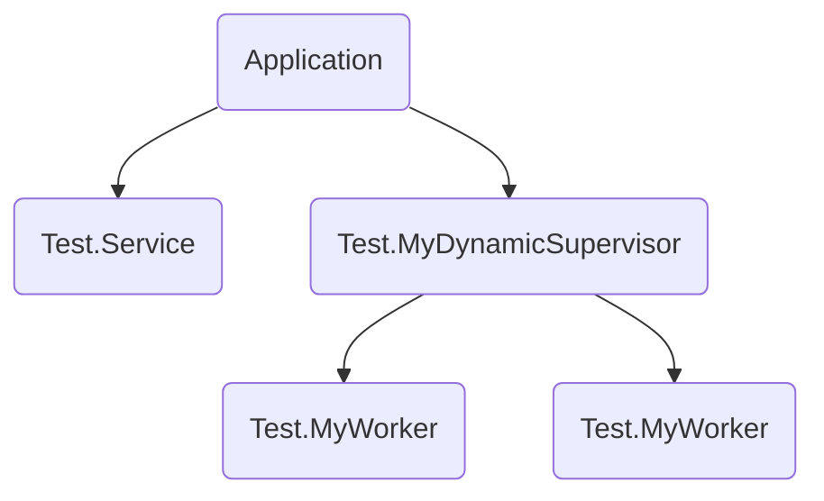
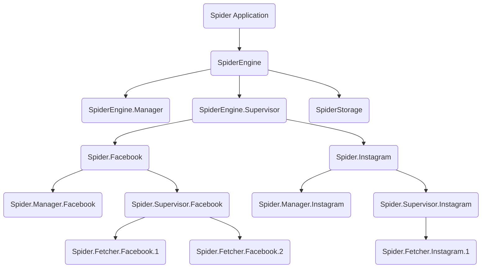
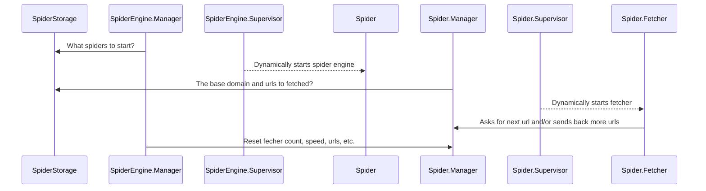

title: Multi-level dynamic supervision in Elixir
date: 2020-09-06 22:10:10
tags:
  - Elixir
  - Supervisor
  - OTP
categories:
  - Sword
---

The most fantastic concepts in Erlang & Elixir that fascinate me are:

1. Everything can be a process.
2. Let it crash.

[GenServer, Elixir API Documentation]: https://hexdocs.pm/elixir/GenServer.html#module-when-not-to-use-a-genserver

>If you don't need a process, then you don't need a process. Use processes only to model runtime properties, such as mutable state, concurrency and failures, never for code organization.
>
> quoted from [GenServer, Elixir API Documentation]

In order to fully embrace these features in every programs I write, learning OTP, GenServer, Supervisor is a must.

But every senior developer knows something very well:  **There is a large gap between knowing something in the book and using it**.

[Programming Elixir ≥ 1.6]: https://pragprog.com/book/elixir16/programming-elixir-1-6

When reading the「[Programming Elixir ≥ 1.6][]」, everything makes sense to me on the chapters about OTP Servers and Supervisors.  But when I tried to implement my own version for a more sophisticated scenario, I realized how big that gap is for me.  

In this arctile, I would like to help you bridge the gap using my experience and the sophisticated enough scenario which seldom found in other tutorials.


## 1-Level

In many tutorials on `Supervisor`, they first tell us to create an application that has such capability by running command `mix new test --sup`.  The `application.ex` created in the project will be similar as below.  The application itself becomes a Supervisor that contains a defined set of children.  

```elixir
defmodule Test.Application do

  use Application

  def start(_type, _args) do
    children = [
      {Test.Service, []}
    ]

    opts = [strategy: :one_for_one, name: Test.Supervisor]
    Supervisor.start_link(children, opts)
  end
end
```

Later when the tutorial introduces the concept of `DynamicSupervisor`, it may define a module and modify the `application.ex` like this:

```elixir
defmodule Test.MyDynamicSupervisor do
  use DynamicSupervisor

  def start_link(init_arg) do
    DynamicSupervisor.start_link(__MODULE__, init_arg, name: __MODULE__)
  end

  def start_child(foo, bar) do
    spec = %{id: Test.MyWorker, start: {Test.MyWorker, :start_link, [foo, bar]}}
    DynamicSupervisor.start_child(__MODULE__, spec)
  end

  @impl true
  def init(init_arg) do
    DynamicSupervisor.init(strategy: :one_for_one)
  end
end
```

```elixir
  # Modified in applicaiton.ex to include the Test.MyDynamicSupervisor
  def start(_type, _args) do
    children = [
      {Test.Service, []},
      Test.MyDynamicSupervisor
    ]

    opts = [strategy: :one_for_one, name: Test.Supervisor]
    Supervisor.start_link(children, opts)
  end
```

The process hierarchy for the above example is:



In a word, most of the tutorial about `Supervisor`, especially `DynamicSupervisor`, only has 1-level depth.

But the real world is much more than that.


## Multi-Level

My application that involves multi-level supervision is a classic scenario for many personal or large corporate projects, Web Crawling.  This scenario is far more real and practical than most of the examples in the tutorials out there.  The process hierarchy of the application design is:



You may have already known, most of the modules are normal `GenServer` except these:

* **Supervisor**: `SpiderEngine`, `Spider.Instagram`, `Spider.Facebook`
* **DynamicSupervisor**: `SpiderEngine.Supervisor`, `Spider.Supervisor.Instagram`, `Spider.Supervisor.Facebook`

### Why the design



* `SpiderEngine` is the root of the whole web crawler.
    The reason of not using Application directly as root because the application might contain other components, such as Phoenix API and Web UI to help managing the crawler.

    The benefit of grouping all crawling behaviors under one particular module is the freedom to move them all at once easily if necessary.

* `SpiderEngine` must be able to supervise different types of crawlers depending on the nature of the websites or systems you want to crawl information from.

* Types of the supported spiders should be configurable so that there must a `DynamicSupervisor` under `SpiderEngine`.

* The reason of separating `xxx.Manager` from the `xxx.Supervisor` is that `Supervisor/DynamicSupervisor` is purely for process supervision.  There can be no other message passing between the `Supervisor/DynamicSupervisor` and children workers.  Hence, all children workers' control logic have to be in the other module, `xxx.Manager`.  

* `Spider.Facebook`, `Spider.Instagram` and other possible crawlers for different websites, are supervisor of their own to manage their own crawling policy, frequency, fetcher count, etc.

### Code

I hope the process hierarchy and sequence diagram explain clearly enough.  Let's move on to the real code.  Actually, there are only two things that you need to clearly understand in order to keep your thought straight on building the process hierarchy.

**start_link/3**

The most important thing to be awared is the `name` option in `start_link/3`.  It's for **Name Registration** which causes trouble if you do not pay attention to when constructing the multi-level supervision.

In my scenario, `SpiderStorage`, `SpiderEngine.Manager`, `SpiderEngine` and `SpiderEngine.Supervisor` only have one running process.  Hence, their calls to `start_link/3` can be simply:

```elixir
GenServer.start_link(__MODULE__, :no_args, name: __MODULE__)

Supervisor.start_link(__MODULE__, :no_args, name: __MODULE__)

DynamicSupervisor.start_link(__MODULE__, :no_args, name: __MODULE__)
```

However, for the `Spider`, `Spider.Mananger`, `Spider.Supervisor`, they have multiple processes for different types of spiders.  Hence, their names should be differentiated.

```elixir
# for Spider
Supervisor.start_link(__MODULE__, spider_config, name: :"Spider.#{spider_config.name}")

# for Spider.Manager
GenServer.start_link(__MODULE__, spider_config, name: :"Spider.Manager.#{spider_config.name}")

# for Spider.Supervisor
DynamicSupervisor.start_link(__MODULE__, :no_args, name: :"Spider.Supervisor.#{spider_config.name}")
```

How about `Spider.Fetcher`?  There are also multiple processes for it, but do we have to start them with different names?  

I think it's a judgement call.  The communication between `Spider.Fetcher` and `Spider.Manager` are through PID.    Hence, if you have saved those children PID somewhere when `Spider.Manager` starts them, or the message is sent from `Spider.Fetcher` to `Spider.Manager` to get information, it's not quite necessary to name this type of children workers, especially when their amount is large.

```elixir
# for Fetcher, you can omit the name option or simply use a combined index as name
def start_link(state = {spider_name, index, _manager_pid}) do
  GenServer.start_link(__MODULE__, state, name: :"Spider.Fetcher.#{spider_name}.#{index}")
end
```

**Child Spec**

There are different forms of child specification when we start them by Supervisor:

* A map
* A tuple with a module as first element and the start argument as second
* A module

Below three samples are equal:

```elixir
# I just present three forms here.
# They cannot all exist in one children list for Supervisor.
children: [
  %{
    id: Child,
    start: {Child, :start_link, [[]]}
  },
  {Child, []},
  Child
]
```

If you are using the map form, it's important to know that, the `id` field is used by the supervisor internally to identify the child.  Hence, even in our scenario with multi-level supervision, we do not need to use spider name to differentiate it besides module name.

**start_child/2**

This is where you should pay attention to.

The first argument of the supervisor's reference.  It can be PID or other name forms used in **Name Registration**.  

So in this spider scenario, the only place need to take care is the `Spider.Supervisor` where it starts the `Spider.Fetcher`.  

```elixir
# The spec can be any one of the three forms above.
# The important thing is that the supervisor name matches the one used in start_link/3
DynamicSupervisor.start_child(:"Spider.Supervisor.#{spider_name}", spec)
```


## End

I hope this more sophisticated and real world example can help you understand the OTP Supervision more clearly.

Be used to model the system by process and modelling them correctly are just the first step on learning OTP.  Next, it would be the message passing between the them for coordination.  I will share more when this web crawling project goes.

Please don't hesitate to leave a comment if you have anything supplement or good advice.
