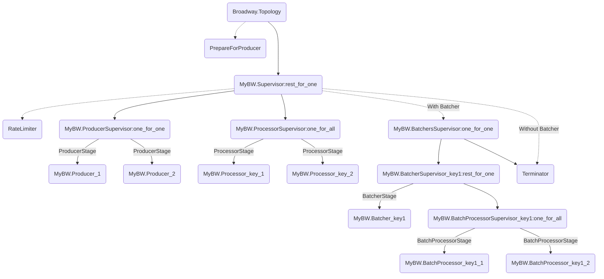

title: broadway-source-reading-entry-and-architecture
date: 2021-03-30 21:26:58
tags:
  - Elixir
categories:
  - Sword
---

[Broadway]: https://hexdocs.pm/broadway/Broadway.html

I have learned Elixir for a while and always want to see if I can start reading any opensource project to learn from.  

Two reasons to pick [Broadway][] as a start:  

* Its code base is quite small and has 18 modules in total.  
* The project in my company uses messaging components a lot.  

Hence, reading it has much benefit on how to design a message processing tool with well-reasoned architecture.  Maybe, after this, I can try writing the right producer for the messaging component we use and rewrite the project in Elixir as well. :D

## Entry Point

According to the Documentation:

>In order to use Broadway, you need to:
>
>1. Define your pipeline configuration
>2. Define a module implementing the Broadway behaviour

Obviously, the first source file I checked out is `broadway.ex`.  It does not have much logic there except the necessary behaviors and functions to get/update rate limiting.

The entry point is the `start_link` function which in turn calls `Topology.start_link(module, opts)` after option validation.

## Architecture Diagram

Following `Topology.ex` and having an overview on what its `start_link` does, I first drafted the overall processes diagram of Broadway.  In order to know a codebase well, I tend to learn its architecture before diving into detail.  

Say, if we name our broadway name as `MyBW`, then the started processes would be:

This diagram shows more components than the pipeline diagram in Broadway Documentation.  However, they are mainly the `Supervisor`s for different components.

The dashed line means optional components.  The text on the line mainly shows what module is used for the process, except the "With Batcher" and "Without Batcher" ones.

I also put the supervision strategy besides the Supervisor.

Most of the things make sense for me now but I still have one question:

Why `ProcessorSupervisor` and `BatchProcessorSupervisor` use `:one_for_all` instead of `:one_for_one`?  The Processors need to all live or crash?  I think I will get the answer after reading the processors part.

