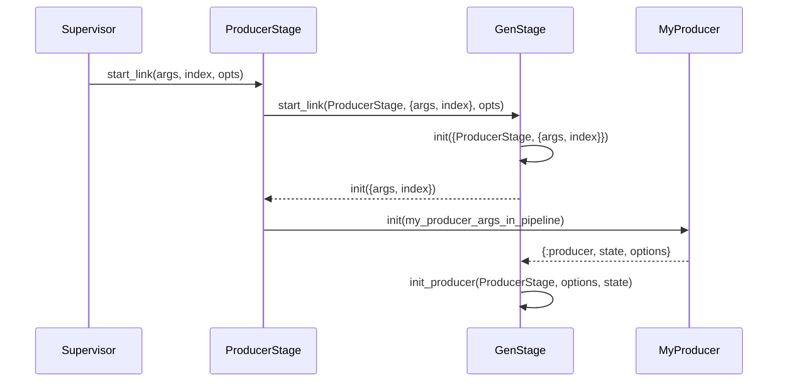
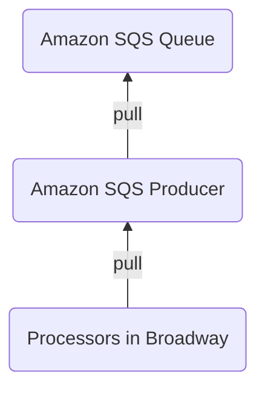
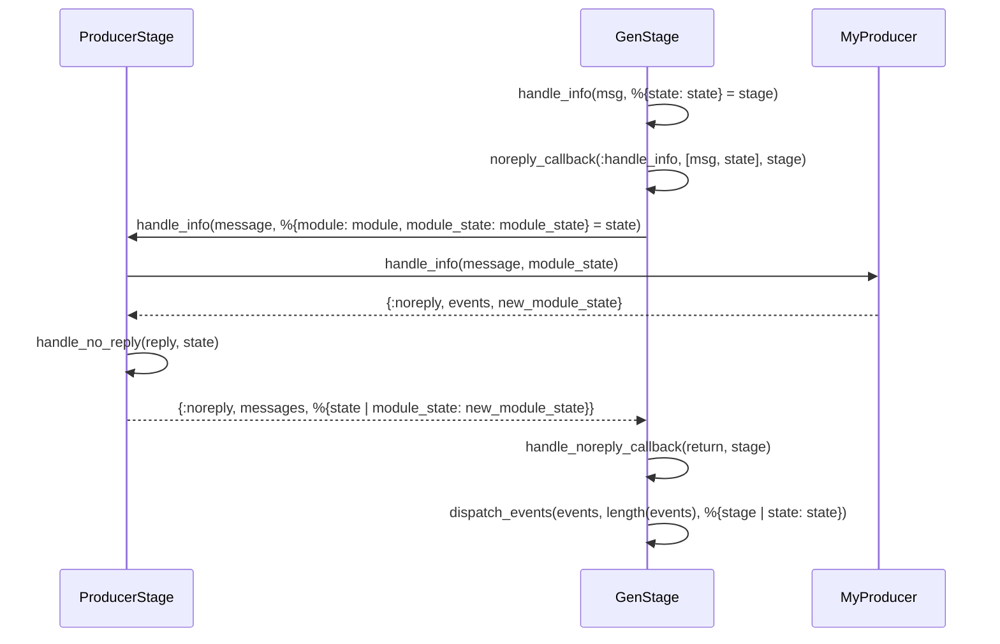
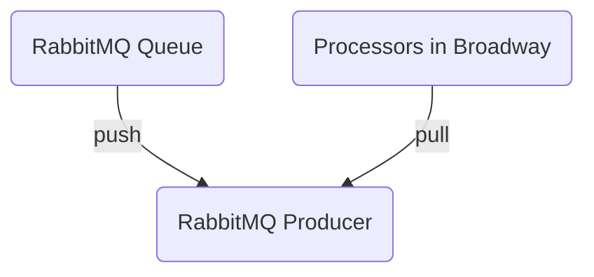
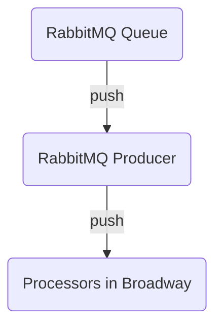

title: Broadway Source Reading (Part 2 - Producer)
date: 2021-05-07 23:45:55
tags:
  - Elixir
  - Source Reading
categories:
  - Sword
---

After having an overview on the [Broadway's architecture](http://www.thinkingincrowd.me/2021/03/30/broadway-source-reading-entry-and-architecture/), I want to know how the basic Broadway pipeline works with only `Producer` and `Processor` options, such as this sample in the official Documentation:

```elixir
defmodule MyBroadway do
  use Broadway

  def start_link(_opts) do
    Broadway.start_link(MyBroadway,
      name: MyBroadwayExample,
      producer: [
        module: {Counter, []},
        concurrency: 1
      ],
      processors: [
        default: [concurrency: 2]
      ]
    )
  end

  ...callbacks...
end
```


## Producer

As the beginning of the Broadway pipeline, the `producer` module should either keep generating events/messages as the data source, or forwarding the queue messages that your Messaging Middleware receives from other external systems to downstream consumers.  

Broadway has provided officially-supported producers for Messaging Middleware like Amazon SQS, Apache Kafka, Google Cloud Pub/Sub and RabbitMQ.  How do these producers work with Broadway?  What I need to know if I want to implement one for other Messaging Middlewares?

### Initialization

As shown in [Part 1 - Entry Point and Architecture](http://www.thinkingincrowd.me/2021/03/30/broadway-source-reading-entry-and-architecture/), `Topology.build_producers_specs/2` generates child specs of `ProducerStage` in the process supervision hierarchy.  The `ProducerStage` module `use GenStage` and acts as a wrapper of the producer module you specify in pipeline and delegates function calls to it, such as `handle_demand`, `handle_call`, `handle_cast`, `handle_info`, `prepare_for_draining` and `terminate`.  Its startup call sequence is:  




## Message Consumption

There are two approaches to consume messages in the Messaging Middlewares:  **Pull** and **Push**.  **Pull** is like you ask for tasks from your boss instead of your boss **Push** them to you. (Although in real life, you might have the opposite experience unless your company is using [Kanban](http://www.thinkingincrowd.me/2015/05/20/Dive-into-Kanban-1-What-is-it/).  :D)

For above mentioned Messaging Middlewares:  

* RabbitMQ is pushed-based.  
* Amazon SQS, and Apache Kafka are pull-based.  
* Google Cloud Pub/Sub and can do both.  

Because `GenStage`'s philosophy is **Pull**, how do two different message consuming models work with Broadway?  Let's use the source code of Amazon SQS and RabbitMQ's Broadway Producer to illustrate below.  


### Pull (Proactive)  



In the source code of [`broadway_sqs/producer.ex`](https://github.com/dashbitco/broadway_sqs/blob/78d32ba2d05ff6e9da3dc89948f91fd9d33299aa/lib/broadway_sqs/producer.ex#L214), the messages are to receive in the `handle_demand` callback because it's the timing when consumers pulls for messages.  

```elixir
  @impl true
  def handle_demand(incoming_demand, %{demand: demand} = state) do
    handle_receive_messages(%{state | demand: demand + incoming_demand})
  end
```

`handle_receive_messages` tries to get messages from SQS to meet the demand from consumers.  If the count of the messages is less than the demand, the producer schedules itself a signal to receive messages again until all demand is met.  

The messages received in scheduled task are handled in `handle_info` callback.

```elixir
  @impl true
  def handle_info(:receive_messages, state) do
    handle_receive_messages(%{state | receive_timer: nil})
  end
```

Replying messages in `handle_demand` callback is not difficult to understand because that is where `GenStage` passes messages to consumers.  However, why `handle_info` can be used for the same purpose?  

In `GenStage`:

```elixir
  ## Catch-all messages

  def handle_info(msg, %{state: state} = stage) do
    noreply_callback(:handle_info, [msg, state], stage)
  end


  ## Shared helpers

  defp noreply_callback(:handle_info, [msg, state], %{mod: mod} = stage) do
    if function_exported?(mod, :handle_info, 2) do
      handle_noreply_callback(mod.handle_info(msg, state), stage)
    else
      log = '** Undefined handle_info in ~tp~n** Unhandled message: ~tp~n'
      :error_logger.warning_msg(log, [mod, msg])
      {:noreply, %{stage | state: state}}
    end
  end

  defp handle_noreply_callback(return, stage) do
    case return do
      {:noreply, events, state} when is_list(events) ->
        stage = dispatch_events(events, length(events), %{stage | state: state})
        {:noreply, stage}

      {:noreply, events, state, :hibernate} when is_list(events) ->
        stage = dispatch_events(events, length(events), %{stage | state: state})
        {:noreply, stage, :hibernate}

      {:stop, reason, state} ->
        {:stop, reason, %{stage | state: state}}

      other ->
        {:stop, {:bad_return_value, other}, stage}
    end
  end
```

And in `ProducerStage`:

```elixir
  def handle_info(message, state) do
    %{module: module, module_state: module_state} = state

    message
    |> module.handle_info(module_state)
    |> handle_no_reply(state)
  end

  defp handle_no_reply(reply, %{transformer: transformer} = state) do
    case reply do
      {:noreply, events, new_module_state} when is_list(events) ->
        messages = transform_events(events, transformer)
        {state, messages} = maybe_rate_limit_and_buffer_messages(state, messages)
        {:noreply, messages, %{state | module_state: new_module_state}}

      {:noreply, events, new_module_state, :hibernate} ->
        messages = transform_events(events, transformer)
        {state, messages} = maybe_rate_limit_and_buffer_messages(state, messages)
        {:noreply, messages, %{state | module_state: new_module_state}, :hibernate}

      {:stop, reason, new_module_state} ->
        {:stop, reason, %{state | module_state: new_module_state}}
    end
  end
```

So the call sequence flow is:



As a result, the events returned from `handle_info` in our producer module will be dispatched to the consumers at the end.  


### Push (Passive)  



According to this simple flow diagram, messages are pushed to the queue consumers if the queue has messages.  However, it's possible that no broadway consumers ask for any message at that time.  Or there are times that the broadway consumers ask for messages but none pushed from queues.  How does this work?  

According to the source code of [RabbitMQ Broadway Producer](https://github.com/dashbitco/broadway_rabbitmq/blob/ddd58d468d8d47b0487aea6a0f170cd3f82f03b8/lib/broadway_rabbitmq/producer.ex#L466), `handle_demand` does nothing.  

```elixir
  @impl true
  def handle_demand(_incoming_demand, state) do
    {:noreply, [], state}
  end
```

As a result, demand request from consumers is ingored by the producer.  To control Back-pressure, option `:prefetch_count` is used.  And the flow diagram should be this instead:  



There are three steps to make this work:  

* The Broadway RabbitMQ producer uses `:amqp` which uses `:amqp_client` to [connect](https://github.com/dashbitco/broadway_rabbitmq/blob/ddd58d468d8d47b0487aea6a0f170cd3f82f03b8/lib/broadway_rabbitmq/producer.ex#L663) to RabbitMQ, it calls the client's [consume](https://github.com/pma/amqp/blob/ddf3d1fae8a40a5e2edf4fa7afa3ef33eebe85f3/lib/amqp/basic.ex#L375) method to register its process as a queue consumer.  

* Then every time a message is pushed from the queue, the producer's process will receive message with structure [`{:basic_deliver, payload, meta}`](https://github.com/pma/amqp/blob/ddf3d1fae8a40a5e2edf4fa7afa3ef33eebe85f3/lib/amqp/basic.ex#L331).  

* In the same way we explored above, the `handle_info` method of RabbitMQ producer returns the message for `GenStage` to dispatch.  

```elixir
def handle_info({:basic_deliver, payload, meta}, state) do
  %{channel: channel, client: client, config: config} = state
  %{delivery_tag: tag, redelivered: redelivered} = meta

  # Omitted some code for acknowledger here.

  metadata =
    meta
    |> Map.take(config[:metadata])
    |> Map.put(:amqp_channel, channel)

  message = %Message{
    data: payload,
    metadata: metadata,
    acknowledger: acknowledger
  }

  {:noreply, [message], state}
end
```

Now we basically know how the producer receives and dispatches messages, we can move forward to the processors next.  
