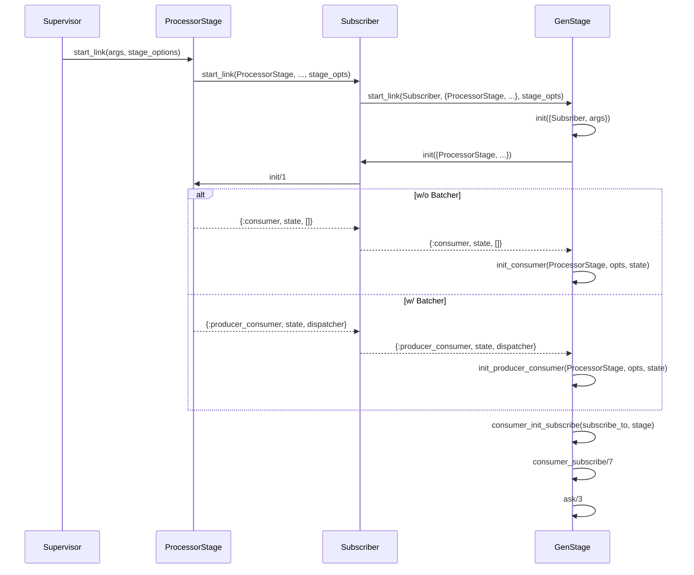
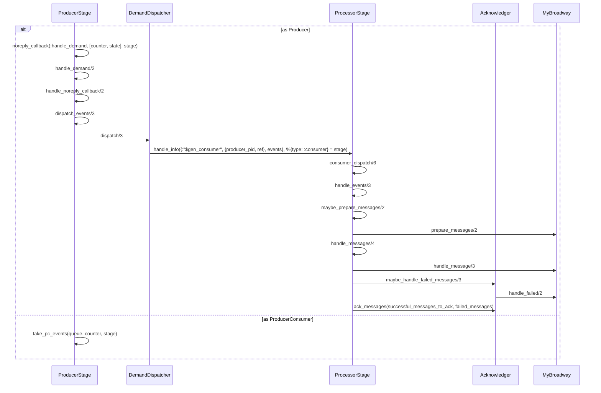

title: Broadway Source Reading (Part 3 - Processor)
date: 2021-06-19 14:26:44
tags:
  - Elixir
  - Source Reading
categories:
  - Sword
---

[the Producer part]: http://www.thinkingincrowd.me/2021/05/07/broadway-source-reading-producer/

Normally, we only need to define the pipeline options for the Messaging Middleware Producer, Processor, and implement the `handle_message/3` callback to use Broadway.  

The complexity of how the `handle_message/3` is called, how the messages got acknowledged and how the failed messages handled all hide behind.  That is the part I would like to know by reading the source code.  As we have gone through [the Producer part][], I bet $10 dollars the questions above should be able to answer after reading the Processor part.  


## Startup Call Sequence

With the experience on the startup call sequence of Producer, we can find that the one for Processor is quite similar:  



At the end of the call, the processor `ask/3` for messages immediately after subscribing to the producers.  The process of ProcessorStage sends a `:"$gen_producer"` message to the producer process it subscribes to.  In the producer's `handle_info/2`, it calls `dispatcher_callback/3` and redirect the call to dispatcher module's `ask/3` method that passes the result to `handle_dispatcher_result/2`.


## Message Consuming as a Consumer (w/o Batcher)

There are two branches in the `case` statement in `handle_dispatcher_result/2`.  As in the simplest configuration, the current process receivng the message is the `:producer` process, so the second path should be taken as a Producer.  

The start of this flow in the Producer matches what we have explored in [the Producer part][].



Here is the tricky thing when the `DemandDispatcher.dispatch` is called.  It sends a `:"$gen_consumer"` message from the Producer process to its subscriber, the consumer, the process of the `ProcessorStage`.  The process of the `ProcessorStage` is a `GenStage`.  In its `consumer_dispatch/6` method, it delegates the call to `mod.handle_events/3` which is the `ProcessorStage` module.  

I always get confused as a novice Elixir programmer on what methods are called as the process of the module, what are called as simple module function.  


## Failed Messages Handling and Acknowledging

If we look into the `ProcessorStage.handle_events/3`, it's clear that each message will be handled by our implemented callback `prepare_messages/2` and `handle_message/3` of our `MyBroadway` module.  Each message will be separated into the `successful_messages` and `failed_messages` categories.

The `failed_messages` will first be passed to `handle_failed/2` of our `MyBroadway` module so that we can do whatever necessary, such as saving them in DB or forwarding to another exception queue before the `Acknowledger` acknowledge them.

The messages are grouped by each message's acknowledger to actually `ack` them.  The message acknowledger is actually from the producer that fulfills the scenario mentioned in documentation:

>where messages are coming from different producers. Broadway will use this information to correctly identify the acknowledger and pass it among with the messages so you can properly communicate with the source of the data for acknowledgement.

What I do not quite understand is that the messages are not passed through the Map (replacing the `true` value) but use the Process dict.  I checked the git history and found that it's the [change](https://github.com/dashbitco/broadway/pull/32/files) made by Jose from a branch named **jv-speed-up-ack**.  Is it faster?  Why?

```elixir
  defp group_by_acknowledger(ackers, messages, key) do
    Enum.reduce(messages, ackers, fn %{acknowledger: {acknowledger, ack_ref, _}} = msg, acc ->
      ack_info = {acknowledger, ack_ref}
      pdict_key = {ack_info, key}
      Process.put(pdict_key, [msg | Process.get(pdict_key, [])])
      Map.put(acc, ack_info, true)
    end)
  end

  defp call_ack({{acknowledger, ack_ref} = ack_info, true}) do
    successful = Process.delete({ack_info, :successful}) || []
    failed = Process.delete({ack_info, :failed}) || []
    acknowledger.ack(ack_ref, Enum.reverse(successful), Enum.reverse(failed))
  end
```


