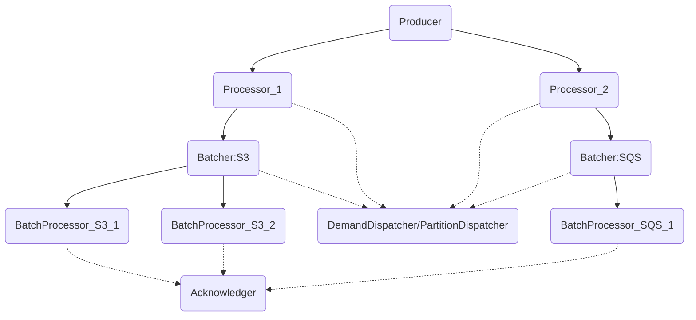
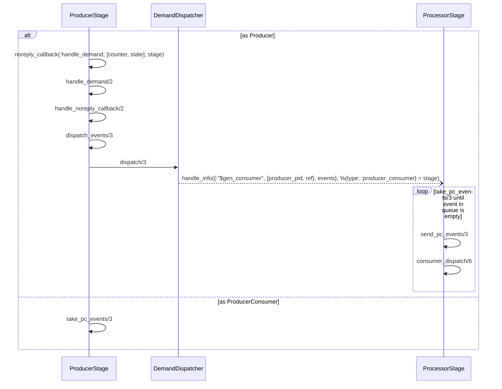
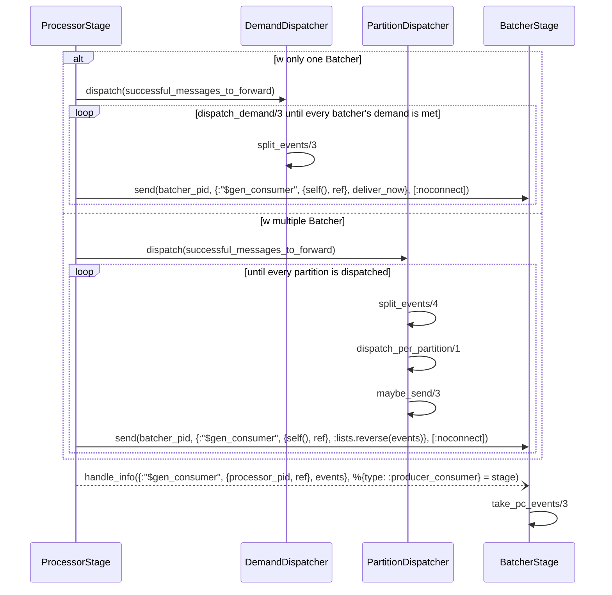
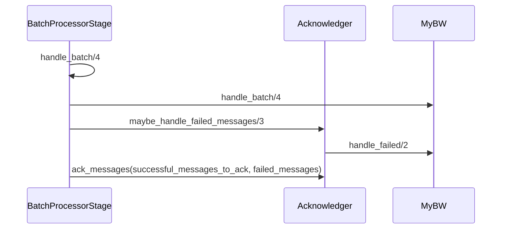

title: Broadway Source Reading (Part 4 - Batching)
date: 2021-07-16 22:50:00
tags:
  - Elixir
  - Source Reading
categories:
  - Sword
---

[the post about processor]: http://www.thinkingincrowd.me/2021/06/19/broadway-source-reading-processor/

## GenStage pipelines

When options for batcher is configured, the processor becomes `:producer_consumer` type.  The GenStage pipeline becomes much more complex than the simple one shown in [the post about processor][].  

_Notes: The communications between the stages are through process message passing, while other interactions between the `DemandDispatcher`, the `Acknowledger` and them are through direct method calls.  The Dispatcher and Acknowledger are not part of the GenStage pipelines and so here uses dotted line to indicate their interactions to have clearer separation._

In the scenario of multiple batchers, `PartitionDispatcher` is used instead of `DemandDispatcher` for the processors in `build_processors_specs/2` and the `:partitions` are set by the keys of the batchers' config.  

The interactions with dispatcher is to register the processes of the `BatcherStage` and `BatchProcessorStage` into the `dispatcher_state` of the processes of `ProcessorStage` and `BatcherStage` respectively for event dispatching.  The source code is the `handle_info/2` in the processes of `ProcessorStage` and `BatcherStage` matching the `{:"$gen_producer", {consumer_pid, ref} = from, {:subscribe, cancel, opts}}` message.  It invokes the `producer_subscribe/3` function, subsequently invokes the function `subscribe(opts, from, dispatcher_state)` of the `DemandDispatcher` or `PartitionDispatcher`.  

## Message Consuming as a Producer Consumer (w Batcher)

The sequence flow which starts with `ProducerStage` changes a little bit as the `ProcessorStage` is changed to be `:producer_consumer` with batchers.  And the `take_pc_events/3` function actually calls `consumer_dispatch/6` that we covered in [the post about processor][].  

Because the messages will be forwarded to the batchers without acknowledgement after processing.  As a result, the `successful_messages_to_ack` is `[]`, and the `successful_messages_to_forward` contain all messages to batchers.  Below is the sub-sequence flow of `dispatch_events/3`:  

Again, the `take_pc_events/3` function of the `BatcherStage` process is triggered.  As you can see, the GenStage pipelines work in such a way repeatedly on each stage.  Hence, we know that the Dispatcher will dispatch the events to `BatchProcessorStage`, and that process receiving the message will invoke `consumer_dispatch/6` and `handle_events/3`.  

Below is the sub-sequence flow of `handle_events/3` in `BatchProcessorStage`:  

Now, we basically know how Broadway works with different pipeline options underneath.  However, it's still far from really understanding it from bottom-up.  When I was working on this post, I came across one interesting [article](https://dockyard.com/blog/2021/06/24/tuning-broadway-rabbitmq-pipelines-for-latency?utm_medium=email&utm_source=elixir-radar) about Broadway's concurrency and how misconfiguration might have great impact on it.  The author did a lot of debugging to figure it out.  I will see if I can see it from the source code level with the help from this article.  
