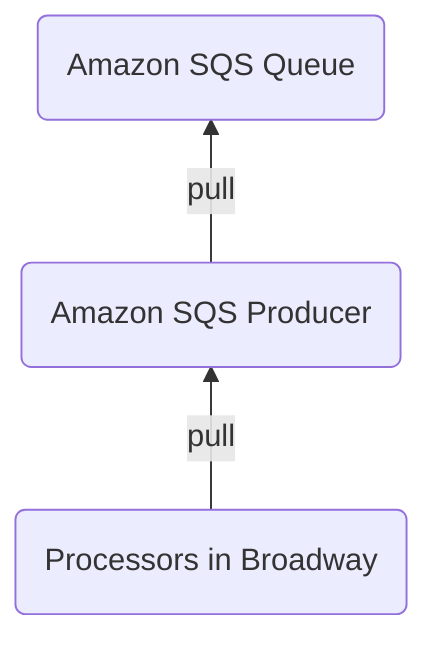
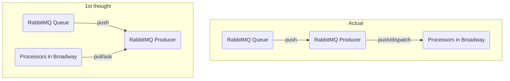
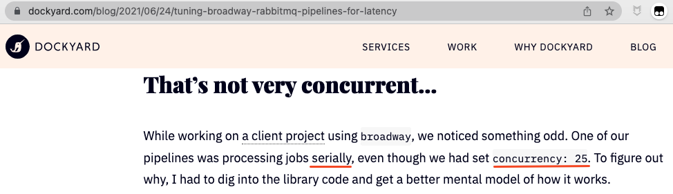

title: Experience of Broadway Source Reading，PR Submission for Bug Fixing
speaker: 鹄思乱想（Ken）
plugins:
    - echarts
    - mermaid

<slide class="aligncenter" image="https://source.unsplash.com/2dqaasndUKE/">

<slide class="aligncenter">

# Source Reading & Fix {.text-landing.text-shadow}

By 鹄思乱想（Ken） {.text-intro}

<slide class="aligncenter ">

# Who am I?

* Blog\: https\://www.thinkingincrowd.me
* Wechat\: ThinkingInCrowd
* Github\: https\://github.com/kenspirit
* Bio\:
    * Consortium Blockchain Platform Developer for Carrier Logistics based on Fabric.
    * Work with Node.js/JAVA，Play with Elixir.
    * Practicing Boxing.


<slide class="aligncenter ">

# Agenda

* What is Broadway?
* Data Process Flow and Source Code
* Problem\: Concurrent Framework Becomes Parallel
* Source Analysis on Bug


<slide class="aligncenter ">

# What is Broadway?


<slide class="">

## What is Broadway? {.aligncenter}

**Concurrent**, **multi-stage** tool for building data ingestion and data processing **pipelines**.

:::div {.text-cols.animated.fadeInUp.slow.delay-2400}

```elixir
defmodule MyBroadway do
  use Broadway

  def start_link(_opts) do
    Broadway.start_link(MyBroadway,
      name: MyBroadwayExample,
      producer: [
        module: {Counter, []},
        concurrency: 2
      ],
      processors: [
        default: [concurrency: 2]
      ]
    )
  end

  ...callbacks...
end
```

```asciidoc
  [producer_1]  [producer_2]
      |     \    /    |
      |      \  /     |
      |       \/      |
      |       /\      |
 [processor_1]  [processor_2]
```

:::

<slide class="">

## Broadway is built on GenStage {.aligncenter}

* Producer\: A stage sends data.
* Consumer\: A stage receives data.

> "Once demand arrives, the producer will emit items, never emitting more items than the consumer asked for.  This provides a back-pressure mechanism." {.animated.fadeInUp.slow.delay-1800}

**Characteristics: Ask demand from Upstream.** {.animated.fadeInUp.slow.delay-4s}


<slide class="aligncenter ">

# Data Process Flow and Source Code


<slide class="aligncenter ">

## Pull (Proactive)



<slide class="aligncenter ">

# Push (Passive)

RabbitMQ **prefetch_count** option




<slide>

## How do Producers Distribute Msgs? {.aligncenter}

#### Subscription Logic in Processor

::: {.grid.sm}

!

```elixir {..column ..small ..animated ..fadeInUp ..slow ..delay-4s}
defmodule Broadway.Topology.ProcessorStage do
  use GenStage

  def start_link(args, stage_options) do
    Broadway.Topology.Subscriber.start_link(
      __MODULE__,
      args[:producers],

  ...
end

defmodule Broadway.Topology.Subscriber do
  @behaviour GenStage

  def init({module, names, options, subscription_options}) do
    {type, state, init_options} = module.init(options)

    ...

    # We always subscribe in random order so the load is balanced across consumers.
    names |> Enum.shuffle() |> Enum.each(&subscribe(&1, state))

    ...
  end
end
```

:::


<slide class="">

## How do Producers Distribute Msgs? {.aligncenter}

#### Subscription Logic in GenStage

::: {.grid.sm}

!

```elixir {..column ..small ..animated ..fadeInUp ..slow ..delay-4s}
defmodule GenStage do
  ...

  defp consumer_subscribe(current, to, opts, stage) do
    with {:ok, max, _} <- ...
         {:ok, min, _} <- ...
         {:ok, cancel, _} <- ...
      producer_pid = GenServer.whereis(to)

      cond do
        producer_pid != nil ->
          ref = Process.monitor(producer_pid)
          # 1. Subscription Logic for Producer
          msg = {:"$gen_producer", {self(), ref}, {:subscribe, current, opts}}
          send_noconnect(producer_pid, msg)
          # 2. Subscription Logic for Consumer
          consumer_subscribe(opts, ref, producer_pid, cancel, min, max, stage)
```

:::


<slide class="">

## How do Producers Distribute Msgs? {.aligncenter}

#### 1. Subscription Logic of Producer


```elixir {..column ..small}
defmodule GenStage do
  ...

  def handle_info(
        {:"$gen_producer", {consumer_pid, ref} = from, {:subscribe, cancel, opts}},
        %{consumers: consumers} = stage
      ) do
    case consumers do
      %{^ref => _} -> ...

      %{} ->
        case maybe_producer_cancel(cancel, stage) do
          {:noreply, stage} ->
            mon_ref = Process.monitor(consumer_pid)
            stage = put_in(stage.monitors[mon_ref], ref)
            stage = put_in(stage.consumers[ref], {consumer_pid, mon_ref})
            producer_subscribe(opts, from, stage)
```

```elixir {..column ..small ..animated ..fadeInUp ..slow ..delay-4s}
  defp producer_subscribe(opts, from, stage) do
    %{mod: mod, state: state, dispatcher_mod: dispatcher_mod, dispatcher_state: dispatcher_state} =
      stage

    case maybe_subscribe(mod, :consumer, opts, from, state) do
      {:automatic, state} ->
        stage = %{stage | state: state}

        # Call the dispatcher after since it may generate demand
        # and the main module must know the consumer is subscribed.
        case dispatcher_mod.subscribe(opts, from, dispatcher_state) do
```


<slide class="">

## How do Producers Distribute Msgs? {.aligncenter}

#### 1.1 Subscription Logic of Dispatcher


```elixir {..column ..small}
defmodule GenStage.DemandDispatcher do

  def subscribe(_opts, {pid, ref}, {demands, pending, max}) do
    {:ok, 0, {demands ++ [{0, pid, ref}], pending, max}}
  end
```


<slide class="">

## How do Producers Distribute Msgs? {.aligncenter}

#### 2 Subscription Logic of Consumer


```elixir {..column ..small}
defmodule GenStage do

  defp consumer_subscribe(opts, ref, producer_pid, cancel, min, max, stage) do
    %{mod: mod, state: state} = stage
    to = {producer_pid, ref}

    case maybe_subscribe(mod, :producer, opts, to, state) do
      {:automatic, state} ->
        # Immediately ask for msg after subscription
        ask(to, max, [:noconnect])
        stage = put_in(stage.producers[ref], {producer_pid, cancel, {max, min, max}})

  ...

  def handle_info(
        {:"$gen_producer", {consumer_pid, ref} = from, {:ask, counter}},
        %{consumers: consumers} = stage
      )
      when is_integer(counter) do
    case consumers do
      %{^ref => _} ->
        %{dispatcher_state: dispatcher_state} = stage
        dispatcher_callback(:ask, [counter, from, dispatcher_state], stage)
```


<slide class="">

## How do Producers Distribute Msgs? {.aligncenter}

#### 2.1 `ask` Logic of Dispatcher (Pull, not used by RabbitMQ)


```elixir {..column ..small}
defmodule GenStage.DemandDispatcher do

  def ask(counter, {pid, ref}, {demands, pending, max, shuffle_demand}) do
    max = max || counter

    ...

    {current, demands} = pop_demand(ref, demands)
    demands = add_demand(current + counter, pid, ref, demands)

    already_sent = min(pending, counter)
    {:ok, counter - already_sent, {demands, pending - already_sent, max, shuffle_demand}}
  end
```


<slide class="">

## How do Producers Distribute Msgs? {.aligncenter}

#### `dispatch` Logic of Dispatcher (Push)


```elixir {..column ..small}
defmodule GenStage.DemandDispatcher do

  def dispatch(events, length, {demands, pending, max}) do
    {events, demands} = dispatch_demand(events, length, demands)
    {:ok, events, {demands, pending, max}}
  end

  defp dispatch_demand([], _length, demands) do
    {[], demands}
  end

  defp dispatch_demand(events, _length, [{0, _, _} | _] = demands) do
    {events, demands}
  end

  defp dispatch_demand(events, length, [{counter, pid, ref} | demands]) do
    {deliver_now, deliver_later, length, counter} = split_events(events, length, counter)
    Process.send(pid, {:"$gen_consumer", {self(), ref}, deliver_now}, [:noconnect])
    demands = add_demand(counter, pid, ref, demands)
    dispatch_demand(deliver_later, length, demands)
  end
```


<slide class="aligncenter ">

## Problem\: Concurrent Framework becomes Parallel

!


<slide class="">

## Why is it happening? {.aligncenter}

#### Each producer tries to satisfy the demand of every processor.  **One Processor takes all msgs\:**

::: {.animated .fadeInUp .slow .delay-2400}

> "If a processor asks for two messages and there are two producers, the processor may get four messages.
>
>Since it can only process them one at a time, the others will sit in its process mailbox until it’s ready for them."

:::


<slide class="">

## Solutions {.aligncenter}

| Item                      | Change |
| :-----------              | :------------ |
| Producers                 | M  ->  1 |
| Processors Max Demand     | 10  ->  1 |
| RabbitMQ Prefetch Count   | max_demand * \<number of processors> |


<slide class="">

## Subscription is **NOT** random {.aligncenter}

::: {.grid}

```elixir {..column ..small}
  def start_link(_opts) do
    Broadway.start_link(
      __MODULE__,
      name: __MODULE__,
      producer: [
        module:
          {BroadwayRabbitMQ.Producer,
           queue: Foo.env!(:queue_name),
           connection: Foo.conn_options(),
           qos: [
             prefetch_count: 1
           ],
           on_failure: :reject},
        concurrency: 10,
      ],
      processors: [
        default: [
          concurrency: 10,
          max_demand: 1
        ]
      ]
    )
  end
```

* If {..column}
  1. Producer concurrency\: 10  {.fadeInRight}
  2. RabbitMQ \:prefetch_count\: 1  {.fadeInRight}
  3. Messages count in queue\: 10  {.fadeInRight}
  4. Processors subscribe Producers randomly  {.fadeInRight}
{.build}


* Then in theory
  1. Message got by each Producer\: 1  {.fadeInRight}
  2. Messages spread to random Processors  {.fadeInRight}
{.build}


<slide class="aligncenter ">

# Source Analysis on Bug


<slide class="">

## Subscription is **NOT** random {.aligncenter}

#### Add Debug Log

```elixir {..small}
# Broadway.Topology.Subscriber.init/1

shuffled_names = names |> Enum.shuffle()
IO.inspect("Processor #{inspect(self())} subscribe to Producer #{inspect(Process.whereis(Enum.at(shuffled_names, 0)))} first")
Enum.each(shuffled_names, &subscribe(&1, state))


# GenStage.DemandDispatcher.subscribe/2

IO.inspect("Subscribed #{inspect(self())} from #{inspect(pid)}")
{:ok, 0, {demands ++ [{0, pid, ref}], pending, max}}


# GenStage.DemandDispatcher.dispatch_demand/3

pids = Enum.map(demands, fn {_, other_pid, _} ->
  other_pid
end)
IO.inspect("Producer #{inspect(self())} sends message to consumer #{inspect(pid)} out of #{inspect(pids)}")
```


<slide class="">

## Subscription is **NOT** random {.aligncenter}

#### Debug Log Result

* Processor randomly subscribes to Producer.
* But the subscription msgs to Producers follow Processor startup sequence.

```iex {..small}
"Processor #PID<0.344.0> subscribe to Producer #PID<0.341.0> first"
"Processor #PID<0.345.0> subscribe to Producer #PID<0.333.0> first"
"Processor #PID<0.346.0> subscribe to Producer #PID<0.336.0> first"
"Processor #PID<0.347.0> subscribe to Producer #PID<0.340.0> first"
"Processor #PID<0.348.0> subscribe to Producer #PID<0.341.0> first"
"Processor #PID<0.349.0> subscribe to Producer #PID<0.337.0> first"
"Processor #PID<0.350.0> subscribe to Producer #PID<0.339.0> first"
"Processor #PID<0.351.0> subscribe to Producer #PID<0.339.0> first"
"Processor #PID<0.352.0> subscribe to Producer #PID<0.334.0> first"
"Processor #PID<0.353.0> subscribe to Producer #PID<0.341.0> first"

"Subscribed #PID<0.335.0> from #PID<0.344.0>"
"Subscribed #PID<0.339.0> from #PID<0.344.0>"
"Subscribed #PID<0.341.0> from #PID<0.344.0>"
"Subscribed #PID<0.335.0> from #PID<0.345.0>"
"Subscribed #PID<0.333.0> from #PID<0.344.0>"
"Subscribed #PID<0.335.0> from #PID<0.346.0>"
"Subscribed #PID<0.333.0> from #PID<0.345.0>"
```


<slide class="">

## Msg Distribution is **NOT** random {.aligncenter}

#### Debug Log Result

* Each Producer gets 1 message.
* But every Producer `demands` list is the **same**.
* **ALL** messages sent to the **1st** Processor

```iex {..small}
iex(dev@localhost)1> Foo.send_messages(10)
"Producer #PID<0.342.0> got one message."
...
"Producer #PID<0.341.0> got one message."

"Producer #PID<0.342.0> sends message to consumer #PID<0.344.0> out of [#PID<0.345.0>, #PID<0.346.0>, #PID<0.347.0>, ...]"
...
"Producer #PID<0.341.0> sends message to consumer #PID<0.344.0> out of [#PID<0.345.0>, #PID<0.346.0>, #PID<0.347.0>, ...]"

"processor #PID<0.344.0> got '2'; has 3 message(s) in its mailbox"
"processor #PID<0.344.0> got '3'; has 8 message(s) in its mailbox"
"processor #PID<0.344.0> got '1'; has 7 message(s) in its mailbox"
"processor #PID<0.344.0> got '6'; has 6 message(s) in its mailbox"
"processor #PID<0.344.0> got '4'; has 5 message(s) in its mailbox"
"processor #PID<0.344.0> got '5'; has 4 message(s) in its mailbox"
"processor #PID<0.344.0> got '7'; has 3 message(s) in its mailbox"
"processor #PID<0.344.0> got '10'; has 2 message(s) in its mailbox"
"processor #PID<0.344.0> got '8'; has 1 message(s) in its mailbox"
"processor #PID<0.344.0> got '9'; has 0 message(s) in its mailbox"
```


<slide class="">

## Useless `shuffle` logic in Processor {.aligncenter}

```elixir {..small}
defmodule Broadway.Topology.ProcessorStage do
  use GenStage

  def start_link(args, stage_options) do
    Broadway.Topology.Subscriber.start_link(
      __MODULE__,
      args[:producers],

  ...
end

defmodule Broadway.Topology.Subscriber do
  @behaviour GenStage

  def init({module, names, options, subscription_options}) do
    {type, state, init_options} = module.init(options)

    ...

    # We always subscribe in random order so the load is balanced across consumers.
    names |> Enum.shuffle() |> Enum.each(&subscribe(&1, state))

    ...
  end
end
```


<slide class="">

## When to shuffle `demands` list? {.aligncenter}

* `ask` signal

  * `demands` list is not completely constructed yet. {.animated .fadeInRight .delay-1800}

::: {.animated .fadeInUp .slow .delay-4s}

* First Dispatch

```elixir {..small}
defmodule GenStage.DemandDispatcher do

  # Before Fix
  def dispatch(events, length, {demands, pending, max}) do
    {events, demands} = dispatch_demand(events, length, demands)
    {:ok, events, {demands, pending, max}}
  end

  # After Fix
  def dispatch(events, length, {demands, pending, max, true}) do
    dispatch(events, length, {Enum.shuffle(demands), pending, max, false})
  end

  def dispatch(events, length, {demands, pending, max, false}) do
    {events, demands} = dispatch_demand(events, length, demands)
    {:ok, events, {demands, pending, max, false}}
  end
```

<slide class="aligncenter ">

## Takeaway

* GenServer in Supervision Tree starts up in sequence.
    * Producers receives subscription msg from Processors follow startup sequence.

* Messages sent to the same GenServer receives in sequence.
    * First `subscribe` and then `ask`


<slide class="aligncenter ">

## References

* [Tuning Broadway RabbitMQ Pipelines for Latency](https://dockyard.com/blog/2021/06/24/tuning-broadway-rabbitmq-pipelines-for-latency?utm_medium=email&utm_source=elixir-radar)

* [Broadway Source Reading (Part 1 - Entry Point and Architecture)](https://www.thinkingincrowd.me/2021/03/30/broadway-source-reading-entry-and-architecture/)

* [PR to Broadway](https://github.com/dashbitco/broadway/pull/271)

* [PR to GenStage](https://github.com/elixir-lang/gen_stage/pull/277)
